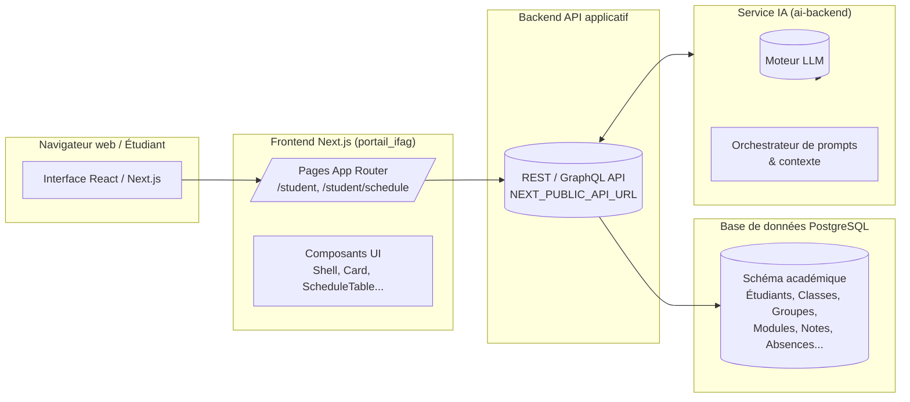
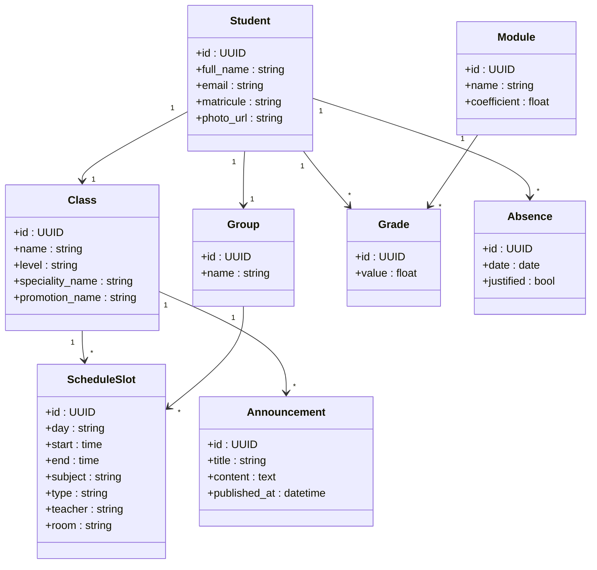
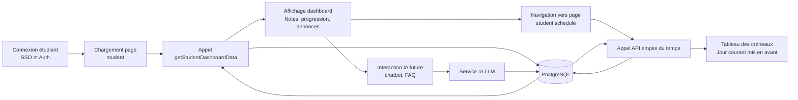
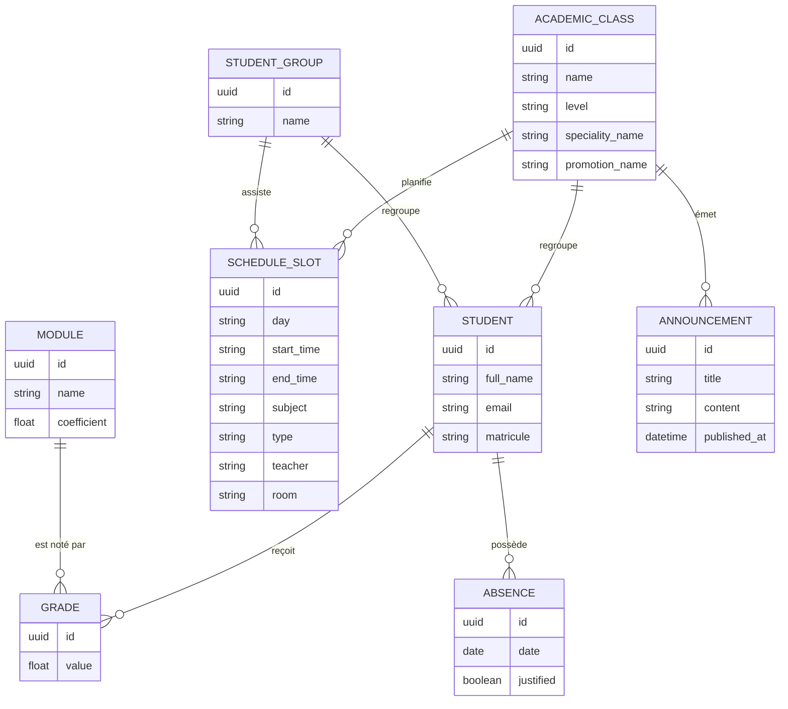
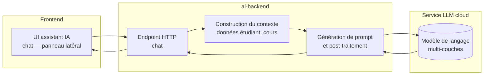
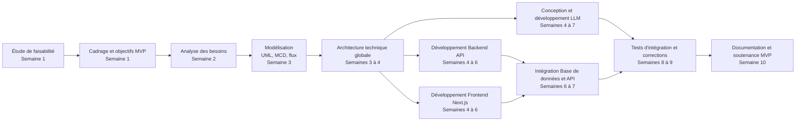
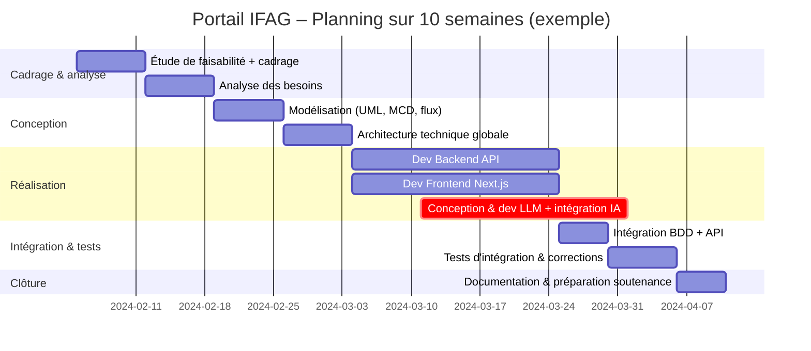

# Portail IFAG – MVP de portail universitaire

> <span style="color:#38bdf8">Portail IFAG</span> est un **MVP** de portail universitaire moderne, développé dans le cadre du **module de Gestion de Projet**.  
> Il propose un **espace étudiant** centralisé (emploi du temps, notes, absences, annonces) et prépare l’intégration d’un **assistant IA** basé sur un LLM.

---

## 1. Contexte du projet

- **Type de projet** : Projet académique – module _Gestion de Projet_
- **Portée** : MVP d’un **portail universitaire** pour les étudiants
- **Chef de projet** : **Youb Mahmoud Nader** (propriétaire de ce dépôt)
- **Objectifs pédagogiques** :
  - Appliquer une démarche de gestion de projet (cadrage, modélisation, architecture).
  - Concevoir un **MVP fonctionnel** prêt à être étendu (v1, production).
  - Documenter l’architecture logicielle et la modélisation (UML, MCD, flux).

---

## 2. Vue d’ensemble fonctionnelle

Fonctionnalités actuelles de l’espace étudiant :

- **Tableau de bord étudiant** (`/student`)
  - Vue synthétique : informations étudiant (nom, groupe, spécialité).
  - Indicateurs : progression académique, moyenne générale, assiduité, progression des vacances.
  - Annonces récentes de l’établissement.
- **Emploi du temps** (`/student/schedule`)
  - Visualisation hebdomadaire par créneaux fixes (08:30–17:30).
  - Mise en avant du jour courant.
  - Distinction visuelle des types de cours (TP / cours magistral / autres).
- **Notes / Absences / Profil**
  - Endpoints déjà prévus dans la navigation pour extension ultérieure.

À terme, le portail sera étendu aux **enseignants**, **administration** et **services pédagogiques**, avec un **assistant IA** (LLM) pour automatiser certaines tâches (FAQ, recommandations, génération de planning, etc.).

---

## 3. Architecture globale

Le projet suit une architecture **multi-couches** :

- **Frontend** : Next.js (App Router) – React/TypeScript.
- **Backend API** : service HTTP (ex. FastAPI / Django / Node) exposé via `NEXT_PUBLIC_API_URL`.
- **Base de données** : PostgreSQL (hébergée, par ex. NeonDB).
- **Service IA (LLM)** : backend `ai-backend` dédié à l’IA (intégration future / progressive).

### 3.1 Schéma haut niveau



---

## 4. Architecture Frontend (Next.js)

Le code fourni montre une **architecture orientée features** autour de l’espace étudiant :

### 4.1 Pages clés

- `app/student/page.tsx`
  - Page principale de **tableau de bord**.
  - Récupère les données via `getStudentDashboardData(studentId)`.
  - Affiche :
    - Bloc identité étudiant.
    - Progress bars (`ProgressBar`, `ProgressCircles`).
    - Notes rapides.
    - Annonces (`announcements`).
    - Widgets académiques + mini emploi du temps (`ScheduleTable`).

- `app/student/schedule/page.tsx`
  - Page détaillée **Emploi du temps** hebdomadaire.
  - Utilise une matrice jour × créneaux horaires pour afficher les cours.
  - Navigation étudiante (mobile + desktop) intégrée dans le layout `Shell`.

### 4.2 Composants et layout

- `Shell`
  - Layout générique : titre, sous-titre, navigation contextuelle (`variant="student"`).
- `Card`
  - Composant de conteneur stylé (cartes).
- `ScheduleTable`
  - Composant de tableau d’emploi du temps compact.
- Autres composants :
  - `ProgressBar`, `ProgressCircles` : visualisation de progression.
  - `BadgePill` : tags de statut (niveau, badges, assiduité).
  - `ExpandStatsButton` : future extension pour détails statistiques.

---

## 5. Architecture Backend & Base de données

Même si l’implémentation complète du backend n’est pas montrée ici, on peut déduire le modèle logique :

- Accès BDD via **PostgreSQL** (`DATABASE_URL`).
- Données agrégées via `getStudentDashboardData(studentId)` :
  - `student` (profil, classe, groupe, spécialité).
  - `schedule` (créneaux de cours).
  - `notesSummary` (moyenne, meilleur module, etc.).
  - `absencesCount`.
  - `announcements`.
  - `academicProgress`, `holidaysProgress`.

---

## 6. Modélisation – Diagrammes (Gestion de Projet)

### 6.1 Diagramme de classes (Vue métier simplifiée)



### 6.2 Diagramme de flux (Vue processus – étudiant)



### 6.3 Modèle Conceptuel de Données (MCD simplifié)



---

## 7. Composant IA – LLM et architecture

Le projet prévoit (ou héberge) un **service IA** dans un dossier dédié (`ai-backend`) qui communique avec un **LLM** (Large Language Model) de type GPT.

### 7.1 Rôle du LLM dans le portail

- Répondre aux **questions fréquentes** des étudiants (règlement, deadlines, procédures).
- Générer des **explications personnalisées** sur les notes et la progression.
- Aider à la **planification** (révisions, rattrapage, organisation hebdomadaire).
- Fournir des **recommandations** contextualisées (basées sur classe, groupe, modules suivis, historique).

### 7.2 Architecture logique du composant IA



### 7.3 Vue interne du LLM (simplifiée)

Le LLM est un **réseau de neurones profond** organisé en couches de **transformers** :

- Entrée : texte (prompt) + contexte (données de l’étudiant).
- Passage par plusieurs couches :
  - **Embedding** des tokens.
  - **Mécanismes d’attention** multi-têtes.
  - **Couches feed-forward** pour la projection dans un espace sémantique riche.
- Sortie : texte généré (réponse en langage naturel).

---

## 8. Mise en route rapide (développement)

### 8.1 Prérequis

- **Node.js** (version LTS recommandée)
- **npm** ou **pnpm** / **yarn**
- Accès à une base **PostgreSQL**
- Fichier `.env.local` correctement rempli (URL BDD, URL API, secrets d’auth)

### 8.2 Installation

```bash
# Cloner le dépôt
git clone <url-du-repo>
cd portail_ifag

# Installer les dépendances
npm install
# ou
pnpm install
```

### 8.3 Lancer le projet

```bash
npm run dev
# puis ouvrir http://localhost:3000
```

---

## 9. Roadmap (MVP → v1)

- [x] Dashboard étudiant avec indicateurs clés.
- [x] Emploi du temps hebdomadaire détaillé.
- [ ] Gestion complète des **notes** (vue par module, export PDF).
- [ ] Gestion avancée des **absences** (justification, notifications).
- [ ] Espace **enseignant** (saisie notes, absences, annonces).
- [ ] Espace **administration** (gestion des classes, groupes, calendriers).
- [ ] Intégration complète de l’**assistant IA** dans le portail.
- [ ] Internationalisation (fr / en).
- [ ] Renforcement sécurité (auth, rôles, audit).

---

## 10. Crédits & gouvernance de projet

- **Chef de projet** : **Youb Mahmoud Nader**
- **Type** : Projet universitaire – module _Gestion de Projet_
- **But** : Démontrer un MVP fonctionnel, documenté, extensible, servant de base pour un portail universitaire complet.

Les autres membres de l’équipe seront ajoutés ultérieurement dans cette section (rôles : développeurs backend, frontend, responsable QA, etc.).

---

## 11. Planification du projet – PERT, Gantt & histogramme de charge

Le projet a été réalisé sur **10 semaines** effectives. La **réalisation technique** (frontend + backend) et surtout la **conception / implémentation du LLM** ont représenté la charge la plus importante.

- **Diagramme PERT** : visualise les **dépendances logiques** entre tâches, met en évidence le **chemin critique**.
- **Diagramme de Gantt** : visualise le **calendrier** (qui fait quoi, quand, et pendant combien de temps).
- **Histogramme de charge** : dérivé du Gantt, il montre la **répartition de l’effort** par phase.

### 11.1 Hypothèses de planning (10 semaines)

- Horizon : **10 semaines** (S1 → S10).
- 1 semaine ≈ 5 jours ouvrés (valeur indicative).
- Certaines tâches sont **en parallèle** (frontend / backend, LLM / autres).
- Le **chemin critique** est dominé par :  
  _Analyse → Conception → Dev LLM / Intégration → Tests → Clôture_.

### 11.2 Diagramme PERT (dépendances, 10 semaines)



**Lecture (exemples)**

- On ne commence pas la **modélisation** (D) avant l’**analyse des besoins** (C).
- Le **dev LLM** (H) dépend de l’**architecture** (E) et s’étale sur **3 semaines** (4→7).
- La **livraison du MVP** (K) dépend des **tests** (J) → c’est la fin du **chemin critique**.

### 11.3 Diagramme de Gantt (10 semaines, vue calendrier)

Exemple de Gantt aligné sur 10 semaines (dates indicatives, l’important est la durée relative).



- Les tâches **backend** et **frontend** démarrent en parallèle à partir de la semaine 4.
- Le **bloc LLM** (`crit`) est volontairement long (≈ 3 semaines) pour refléter le temps important passé sur cette partie.
- L’ensemble du planning tient dans un horizon d’environ **10 semaines**.

### 11.4 Histogramme de charge (dérivé du Gantt)

Histogramme simplifié de la **charge par grande phase** (en semaines-homme approximatives) :

| Phase                                  | Durée approx. (sem.) | Charge relative | Représentation visuelle |
| -------------------------------------- | -------------------- | --------------- | ----------------------- |
| Cadrage & analyse                      | 2                    | Moyenne         | ████████                |
| Modélisation & architecture            | 2                    | Moyenne         | ████████                |
| Dev Backend API                        | 3                    | Importante      | ██████████████          |
| Dev Frontend Next.js                   | 3                    | Importante      | ██████████████          |
| Conception & dev LLM + intégration IA  | 3                    | Très élevée     | ████████████████████    |
| Intégration BDD + API                  | 1                    | Faible          | ████                    |
| Tests d'intégration & corrections      | 1                    | Moyenne         | █████                   |
| Documentation & préparation soutenance | 1                    | Moyenne         | █████                   |

#### 11.4.1 Graphe de répartition de la charge (histogramme)

```mermaid
chart
    title: Répartition de la charge par phase (en "semaines équivalentes")
    type: bar
    xAxisTitle: Phases du projet
    yAxisTitle: Semaines équivalentes
    "Cadrage & analyse": 2
    "Modélisation & architecture": 2
    "Dev Backend API": 3
    "Dev Frontend Next.js": 3
    "Conception & dev LLM + IA": 3
    "Intégration BDD + API": 1
    "Tests intégration & corrections": 1
    "Documentation & soutenance": 1
```

On voit clairement que :

- La **réalisation technique** (backend + frontend) consomme une grande partie des 10 semaines.
- Le **LLM** représente un **pic de charge** (conception, expérimentations, intégration au backend).

### 11.5 Interprétation des diagrammes (vue Gestion de Projet)

- **PERT** : utile pour identifier le **chemin critique** (suite de tâches qui déterminent la durée minimale du projet) et les tâches pouvant être décalées sans impacter la date de fin.
- **Gantt** : permet de **communiquer le planning** à l’équipe (visibilité sur les chevauchements et les jalons).
- **Histogramme de charge** : permet de vérifier que la **charge de travail est réaliste**, d’anticiper les **pics** (ici sur le LLM) et d’ajuster la répartition des ressources si besoin.

---

## 12. Conclusion

Le projet a démontré la faisabilité d’un MVP fonctionnel et documenté, avec une architecture modulaire et extensible. Le **LLM** a représenté un point de tension important, mais le planning et la conception ont permis de le gérer efficacement. Le portail est maintenant prêt à être étendu aux enseignants et services pédagogiques.

---

## 13. Recommandations

- **Étendre le portail** aux enseignants et services pédagogiques.
- **Intégrer un assistant IA** plus sophistiqué (LLM avec contexte, mémoire, etc.).
- **Renforcer la sécurité** (auth, rôles, audit).
- **Internationalisation** (fr / en).
- **Documentation complète** (README, diagrammes, livrables).

---

## 14. Crédits

- **Chef de projet** : **Youb Mahmoud Nader**
- **Type** : Projet universitaire – module _Gestion de Projet_
- **But** : Démontrer un MVP fonctionnel, documenté, extensible, servant de base pour un portail universitaire complet.

Les autres membres de l’équipe seront ajoutés ultérieurement dans cette section (rôles : développeurs backend, frontend, responsable QA, etc.).

---
